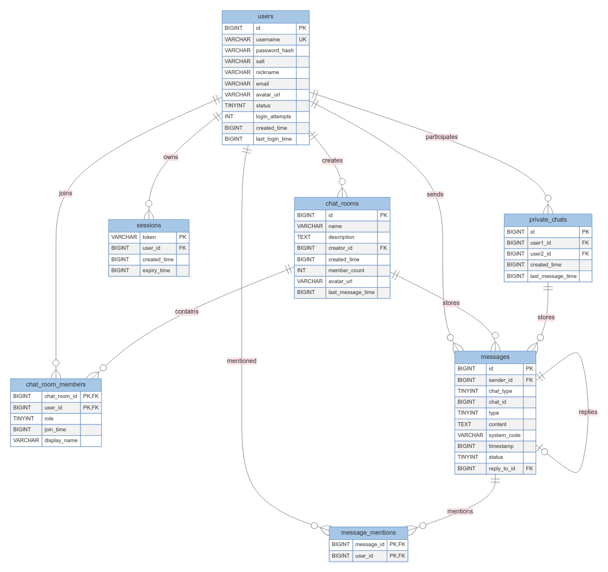
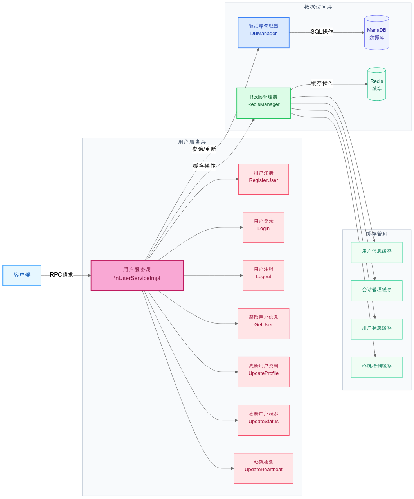

# StarryChat

项目网络层依赖于本人[starry](https://github.com/AidenYuanDev/starry)项目，拥有强悍的性能支持百万并发。项目接合Redis实现了用户管理、聊天室管理、私聊管理和消息处理等模块。

- **配置管理**：基于[yaml-cpp](https://github.com/jbeder/yaml-cpp)实现灵活配置系统
- **数据持久化**：使用[mariadb-connector-c++](https://github.com/mariadb-corporation/mariadb-connector-cpp)连接数据库，实现连接池优化
- **缓存加速**：[redis-plus-plus](https://github.com/sewenew/redis-plus-plus)客户端集成，多级缓存设计 

## 安装

```
# 依赖安装(Arch)
yay -Sy protobuf yaml-cpp  redis-plus-plus  mariadb-connector-cpp-git openssl 
# 项目
git clone --recursive https://github.com/AidenYuanDev/StarryChat.git
```

# 项目简介

## 数据库表结构设计



## 模块组织方式


